# Writeup: Amor &mdash; Dockerlabs
- **Dificultad:** Fácil
- **Plataforma:** Dockerlabs
- **IP Objetivo:** 172.17.0.2
- **Técnicas clave:** Enumeración web, Fuerza bruta SSH, Esteganografía, Escalada de Privilegios

---
### Reconocimiento
Comenzamos verificando la conectividad con **ping** y realizando un escaneo de puertos con **Nmap**:

        $ ping -c 1 172.17.0.2
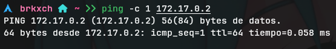

        $ nmap -sS -p- --min-rate 1000 -n -Pn 172.17.0.2
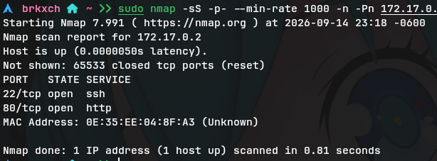

#### Resultado:
- **Puerto 22/tcp:** SSH
- **Puerto 80/tcp:** HTTP

Realizamos un escaneo más profundo para identificar versiones y servicios:

        $ nmam -sCV -p22,80 172.17.0.2
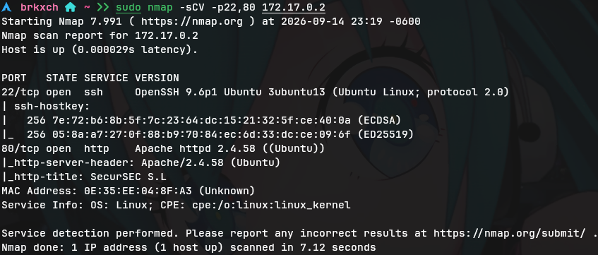

---
### Enumeración Web
Al acceder a ```172.17.0.2``` vemos un panel de "avisos" de una empresa llamada *SecurSEC S.L*.

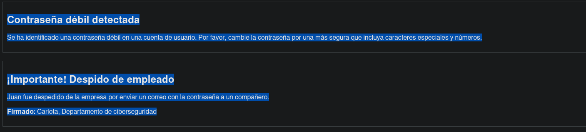

#### Pistas encontradas en la web:
1. **Conttraseña débil detectada:** "Se ha identificado una contraseña débil en una cuenta de usuario. Por favor, cambie la contraseña por una más segura que incluya caracteres especiales y números."
2. **Despido de empleado:** "*Juan fue despedido de la empresa por enviar un correo con la contraseña a un compañero."* Firmado: **Carlota**, Departamento de ciberseguridad.

Esto nos da un posible usuario para una conexión SSH a futuro: ```carlota``` (se omite a ```juan``` por obvias razones, está despedido).

#### Fuzzing de directorios
Ejecutamos ```gobuster``` para buscar rutas ocultas:

        $ gobuster dir -u http://172.17.0.2 -w /usr/share/seclists/Discovery/Web-Content/common.txt

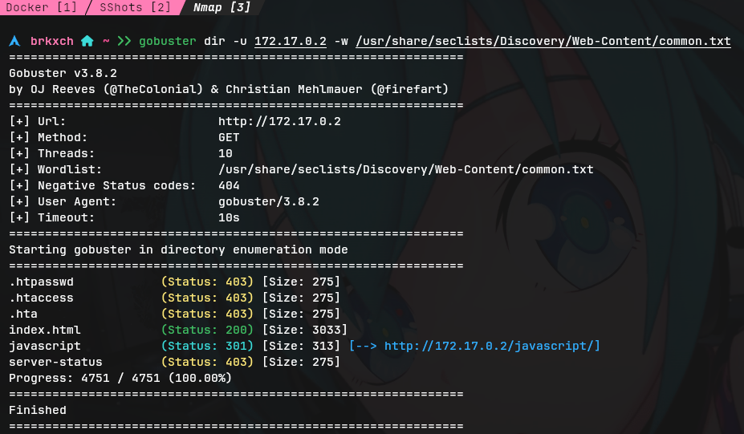

#### Resultado:
- **```/index.html```**     (**Status:** 200) [**Size:** 3033]
- **```/javascript```**     (**Status:** 301) [**Size:** 313] [```--> http://172.17.0.2/javascript/```]
- **```/server-status```**  (**Status:** 403) [**Size:** 275]

Profundizamos en ```/javascript```:

        $ gobuster dir -u http://172.17.0.2/javascript/ -w /usr/share/seclists/Discovery/Web-Content/common.txt    

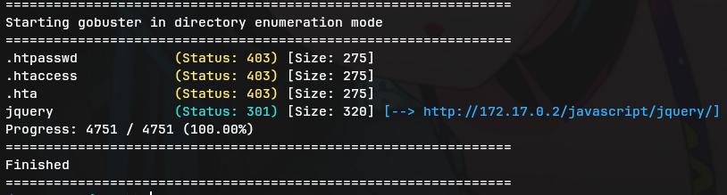

#### Resultado:
- **```/jquery```** &mdash; Directorio sin contenido relevante.

---
### Acceso Inicial (Fuerza Bruta SSH)
Con el usuario obtenido de la web, lanzamos un ataque de fuerza bruta contra SSH mediante **Hydra**:

        $ hydra -l carlota -P /usr/share/wordlists/rockyou.txt ssh://172.17.0.2 -t 4
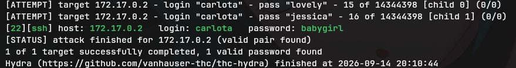

#### Resultado: Credenciales obtenidas.
- **Usuario:** ```carlota```
- **Contraseña:** ```babygirl```

Accedemos por **SSH**:

        $ ssh carlota@172.17.0.2
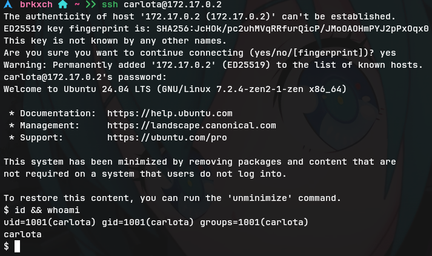

---
### Enumeración Post-Explotación
Dentro de la máquina, revisamos los permisos y buscamos vectores de escalada.

        $ id && whoami
        $ sudo -l
        $ find / -perm 4000 2>/dev/null
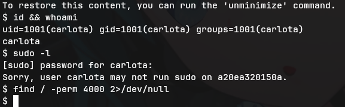

#### Resultado:
- ```carlota``` no tiene permisos ```sudo```.
- No hay permisos **SUID** explotables.

Se procede a buscar archivos sospechosos en el directorio ```/home/``` de ```carlota```:

        $ ls -laR /home/carlota/    
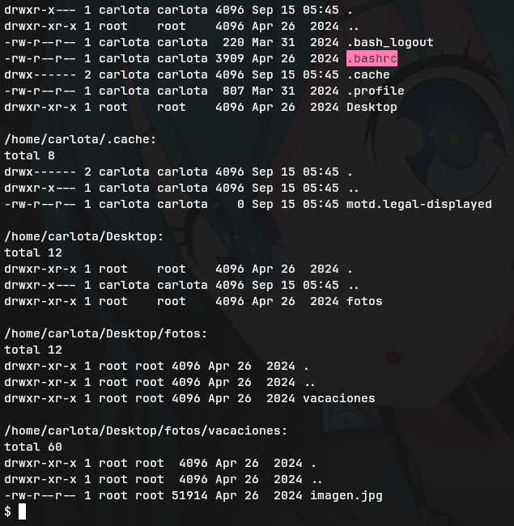

### Revisión del ```.bashrc```
Encontramos un mensaje oculto en el archivo ```.bashrc``` de ```carlota```

- **Mensaje:**
        
        export SECRET="Hola oscar, recuerdas las  \"vacaciones\" que pasamos juntos? En el interior de nuestro amor hay un secreto. ¿Entiendes?"

    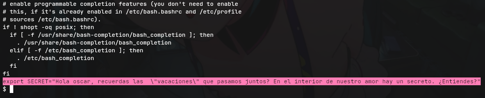

#### Esto nos da varias pistas:
- **Usuario Objetivo:** ```oscar```
- **Palabra clave:** ```vacaciones```
- **Concepto:** *"interior de nuestro amor"*

---
### Esteganografía
Aprovechamos el listado del directorio ```/home/``` que hicimos previamente y siguiendo las pistas obtenidas nos vamos directamente al  directorio ```/home/carlota/Desktop/fotos/vacaciones```.


Extraemos el archivo ```imagen.jpg```  con ```steghide```. No se requirió contraseña (solo presionar Enter).


Se extrajo un archivo de texto llamado ```secret.txt```. Lo leemos con ```cat secret.txt``` y el contenido es un string en **Base64**:

        ZXNsYWNhc2FkZXBpbnlwb24=

Decodificamos:

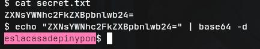

Resultado: *eslacasadepinypon* (posible contraseña de usuario).

---
### Escalada de Privilegios
Cambiamos al usuario ```oscar``` desde la shell de ```carlota```:

        $ su oscar
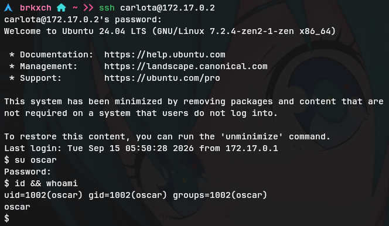

Verficamos permisos de ```sudo```:

        $ sudo -l
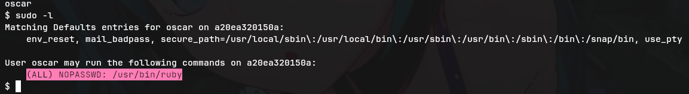

#### Resultado:

        User oscar may run the following commands on a20ea320150a:
            (ALL) NOPASSWD: /usr/bin/ruby

```oscar``` puede ejecutar **ruby** como ```root``` sin contraseña. Aprovechamos esto para obtener una shell con privilegios máximos.

        $ sudo ruby -e 'exec "/bin/bash"'

Confirmamos que somos ```root``` y damos por terminada la máquina:

        $ whoami && id
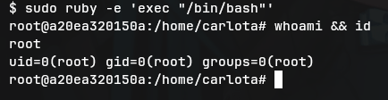

#### Resultado:

        root
        uid=0(root) gid=0(root) groups=0(root)
