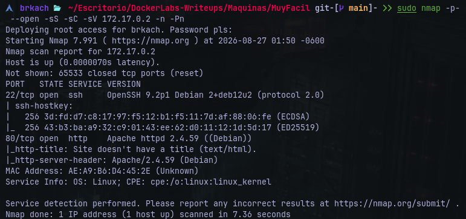
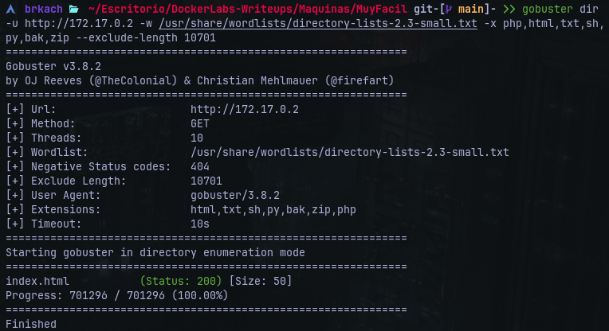
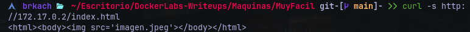
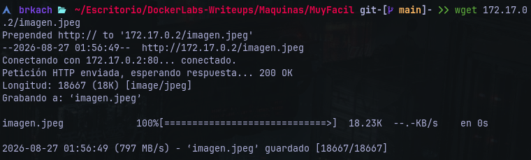
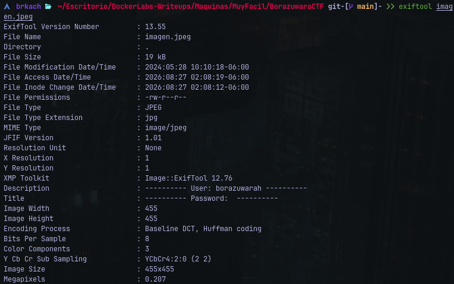
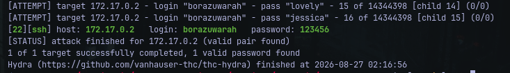
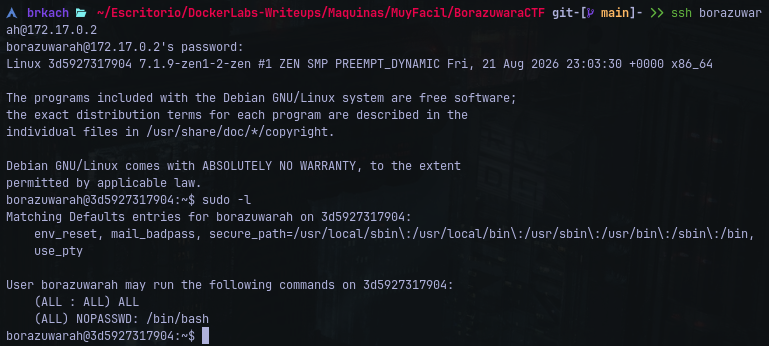
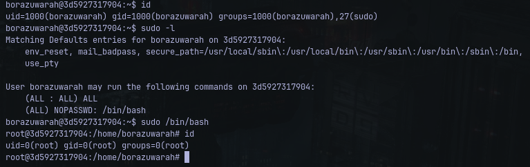

# Writeup: BorazuwarahCTF &mdash; Dockerlabs
- **Dificultad:** Muy Fácil
- **Plataforma:** Dockerlabs
- **IP Objetivo:** 172.17.0.2
- **Técnicas Clave:** Enumeración de Puertos, Fuzzing Web, Análisis de Metadatos, Fuerza Bruta SSH, Escalada de Privilegios

---
### Reconocimiento y Escaneo de Puertos
Se realizó un escaneo completo de puertos TCP sobre la máquina objetivo:

    $ nmap -p- --open -sS -sC -sV 172.17.0.2 -n -Pn



#### Puertos Descubiertos:
- **22/tcp**
- **80/tcp**

---
### Enumeración Web y Fuzzing de Directorios
Se ejecutó un fuzzing sobre rutas y directorios mediante *Gobuster:*

    $ gobuster dir -u http://172.17.0.2 -w /usr/share/wordlists/directory-lists-2.3-small.txt -x php,html,txt,sh,py,bak,zip --exclude-length 10701



#### Resultados:
- ```/index.html``` (Status:200) &mdash; Página principal
- ```/imagen.jpeg``` &mdash; archivo de imagen expuesto tras inspeccionar el index con ```curl```:



---
### Extracción de Metadatos e Información Oculta
Se descargó la imagen a través de ```wget```:



Se procedió a analizar los metadatos de dicha imagen con ```exiftool```:



#### Resultado Obtenido:
El análisis reveló el nombre del usuario válido incrustado en la información de la imagen:
- **Usuario:** borazuwarah

---
### Acceso Inicial mediante Fuerza Bruta SSH
Con el usuario identificado, se ejecutó una entrada de fuerza bruta con *Hydra* contra el servicio SSH utilizando el diccionario *rockyou.txt*:

    $ hydra -l borazuwarah -P /usr/share/wordlists/rockyou.txt ssh://172.17.0.2 -t 16 -f -V -I



#### Credenciales Obtenidas:
- **Usuario:** ```borazuwarah```
- **Contraseña:** ```123456```

Tras obtener las credenciales, se inició una conexión remota mediante SSH

---
### Escalada de Privilegios (```borazuwarah > root```)
Una vez en el sistema, se listaron los privilegios ```sudo``` asignados al usuario:



#### Resultado:
El usuario cuenta con permisos para ejecutar ```/bin/bash``` como superusuario sin requerir contraseña.



Se ejecuta el comando ```sudo su /bin/bash``` y por último se confirma el acceso como administrador.
