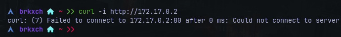
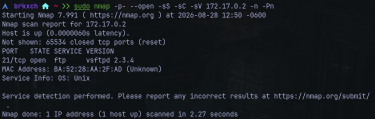
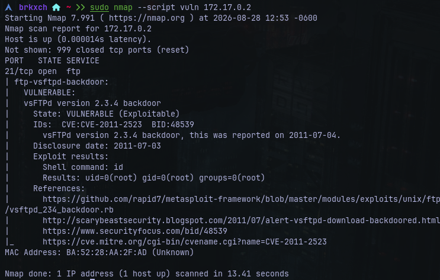
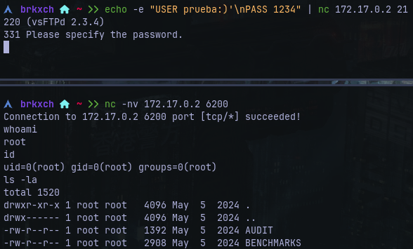

# Writeup: FirstHacking &mdash; Dockerlabs
- **Dificultad:** Muy Fácil
- **Plataforma:** Dockerlabs
- **IP Objetivo:** 172.17.0.2
- **Técnicas Clave:** Enumeración de puertos, identificación de banners, **CVE-2011-2325**

___
# Reconocimiento y Escaneo
- **Conectividad:** Se validó la comunicación ICMP mediante ```ping -c 2 172.17.0.2```.
 
  
  
- **Escaneo de Puertos:**

      $ nmap -p- --open -sS -sC -sV 172.17.0.2 -n -Pn

  

#### Servicios Encontrados
- **21/tcp** &mdash; ```vsftpd 2.3.4```

___
### Análisis y Causa Ráiz
- **Vulnerabilidad detectada:** ```CVE-2011-2325```.
- **Mecanismo:** La versión ```2.3.4``` de ```vsftpd``` contiene una backdoor histórica que se activa al enviar un nombre de usuario que contenga la secuencia ```:)```, abriendo automáticamente una shell interactiva como ```root``` en el puerto ```6200/tcp```.



___
### Verificación de Acceso
- **Activación de la condición:**
- **Conexión a la shell**
- **Confirmación de privilegios**



___
### Remediación
- **Actualización:** Reemplazar el demonio ```vsftpd``` por una versión estable y soportada desde los repositorios oficiales.
- **Firewall:** Bloquear el acceso a puertos no estándar y limitar el tráfico FTP a subredes autorizadas.
- **Aislamiento:** Ejecutar servicios de red bajo usuarios de bajos privilegios y entornos enjaulados (```chroot```).
