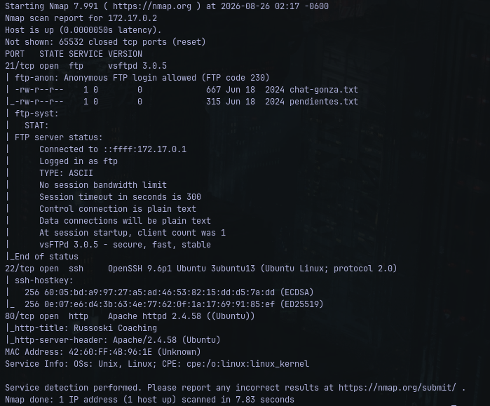
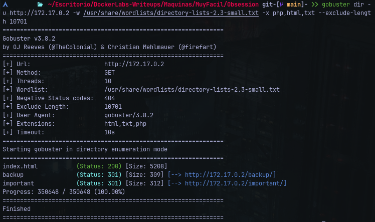
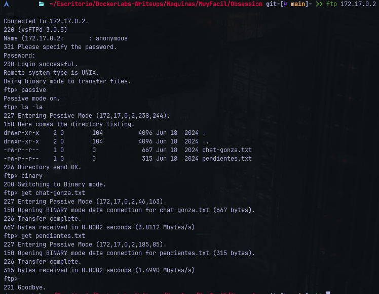
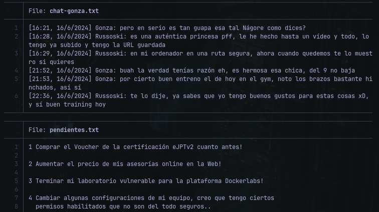
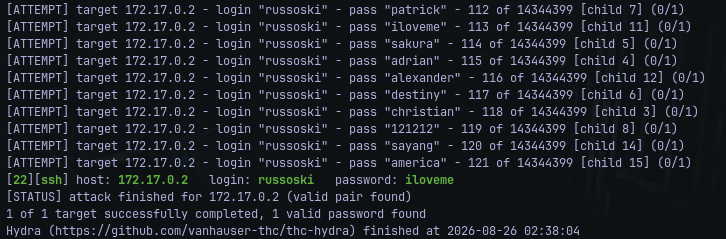
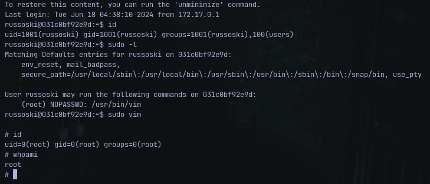

# Writeup: Obsession &mdash; Dockerlabs
- **Dificultad**: Muy Facíl
- **Plataforma**: Dockerlabs
- **IP Objetivo**: 172.17.0.2
- **Técnicas Clave**: Enumeracion de Puertos (Nmap). Fuga de Información por FTP Anónimo,Análisis de Archivos de Texto / OSINT interno, Fuerza Bruta SSH (Hydra), Escalada de Privilegios (GTFOBins)

### Reconocimiento y Escaneo de Puertos
Se realizó un escaneo completo de puertos TCP sobre la máquina objetivo:

    $ nmap -p- --open -sS -sC -sV 172.17.0.2 -n -Pn

<p align="left">
  
</p>

#### Puertos Descubiertos:
- **21/tcp**: FTP
- **22/tcp**: SSH
- **80/tcp**: Servidor Web Expuesto

### Enumeración de Servicios y Fuga de Información
Se realizó fuzzing de directorios y archivos sobre el servidor web utilizando *Gobuster* para identificar posibles paneles o rutas expuestas:

    $ gobuster dir -u http://172.17.0.2 -w /usr/share/wordlists/directory-lists-2.3-small.txt -x php,html,txt --exclude-length 10701 -t 30
<p align="left">
  
</p>

Tras revisar las respuestas web y no encontrar vectores de inyección o paneles adicionales, se procedió con la enumeración del siguiente servicio expuesto

Se interactuó con el servicio *FTP* autenticando como el usuario ```anonymous``` y configurando el modo pasivo para la transferencia de datos:

<p align="left">
  
</p>

Dentro de la sesión FTP se descargaron los archivos de texto disponibles (```pendientes.txt``` - ```chat-gonza.txt```)

<p align="left">
  
</p>

Al inspeccionar el contenido de los archivos descargados se identificó una conversación entre usuarios del sistema que reveló nombres de cuentas validas: ```gonza``` y ```russoski```

### Acceso Inicial
Con los nombres de usuario extraidos de la enumeración de FTP, se ejecutó una entrada de fuerza bruta contra el servicio SSH por cada usuario utilizando *Hydra* y el diccionario *rockyou.txt*:

    $ hydra -l russoski -P /usr/share/wordlists/rockyou.txt ssh://172.17.0.2 -t 16 -f -V

<p align="left">
  
</p>

#### Credenciales Obtenidas:
- **Usuario:**: russoski
- **Contraseña**: iloveme
#### Conexión Remota Exitosa 

### Escalada de Privilegios (```russsoski > root```)
Una vez dentro de la sesión interactiva del usuario ```russoski```, se procedió a verificar los privilegios de sudo asignados con el commando ```sudo -l```:

<p align="left">
  
</p>

#### Resultado
El usuario cuenta con permisos para ejecutar el editor ```/usr/bin/vim``` como ```root``` sin requerir contraseña.<br>Se aprovechan las capacidades de escape de shell del editor, se ejecuta ```sudo vim -c ':!/bin/sh'```,
y por último se realiza una validación de privilegios de superusuario ```root```
