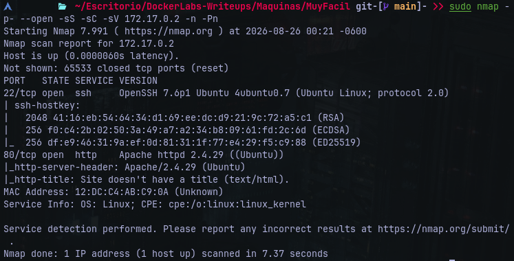
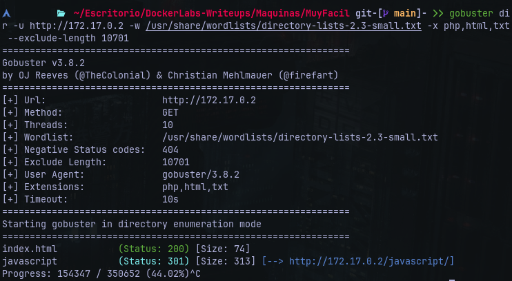
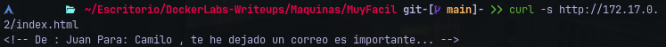
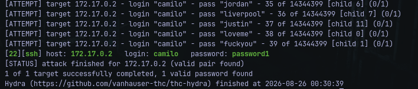
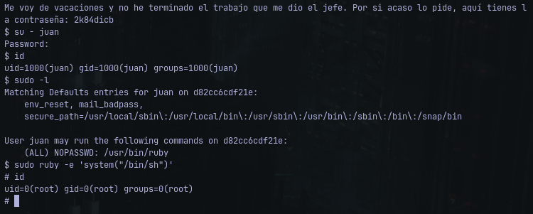

# Writeup: Vacaciones - Dockerlabs
- **Dificultad**: Muy Fácil
- **Plataforma**: Dockerlabs
- **IP Objetivo**: 172.17.0.2
- **Técnicas Clave**: Enumeración Web (Código Fuente), Fuerza Bruta SSH (Hydra), Movimiento Lateral (Credeneciales en Archivo de Correo Local), Escalada de Privilegios (GTFO/Bins)

### Reconocimiento y Escaneo de Puertos
Se inició con un escaneo de puertos TCP sobre el objetivo:

    $ map -p- --open -sS -sC -sV 172.17.0.2 -n -Pn

    
#### Puertos Descubiertos:
- **22/tcp**: Servicio de acceso remoto por SSH
- **80/tcp**: Servidor web expuesto

### Enumeración Web
Se inició la fase de reconocimiento web realizando fuzzing de directorios y archivos sobre ambos puertos utilizando *Gobuster*:

    $ obuster dir -u http://172.17.0.2 -w /usr/share/wordlists/directory-lists-2.3-small.txt -x php,html,txt --exclude-length 10701 -t 30

#### Resultados del escaneo:
- **/index.html**
- **/javascript**



Al notar el tamaño reducido del archivo ```index.html```, se inspeccionó su código fuente:

    $ curl -s http:/172.17.0..2/index.html

Se descubrió el siguiente comentario dejado por un desarrollador:



Esto reveló dos posibles nombres de usuario del sistema; ```juan``` y ```camilo```

### Acceso Inicial
Por lógica se procedió a realizar una entrada de fuerza bruta por SSH contra la cuenta de ```camilo```, utilizando *Hydra* y el diccionario *rockyou.txt*:

    $ hydra -l camilo -P /usr/share/wordlists/rockyou.txt ssh://172.17.0.2 -t 16 -f -V


#### Credenciales Obtenidas:
- **Usuario**: camilo
- **Contraseña**: password1
#### Conexión Remota Exitosa:<br>


### Movimiento Lateral (```camilo > juan```)
Siguiendo la pista del correo dejada en el comentario web, se inspeccionó el buzón local de correos en la ruta ```/var/mail/```:<br>


En el archivo se encontró una nota de ```juan``` indicando que saldría de vacaciones y dejando su contraseña:
- **Usuario**: juan
- **Contraseña**: 2k84dicb

### Escalada de Privilegios (```juan > root```)
Obtenidas las credenciales, se realizó un cambio de usuario, bajo el perfil de ```juan```, se listaron los privilegios especiales de ```sudo```:


### Resultado:
El usuario ```juan``` puede ejecutar ```/usr/bin/ruby``` con privilegios de root sin requerir contraseña.
Aprovechando las capacidades de ejecución del intérprete de *Ruby*, se obtuvo una shell interactiva como superusuario
